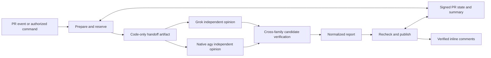

# Architecture and trust boundaries

## Jobs and credentials

| Job | Credentials delivered to process | Executes PR code? |
| --- | --- | --- |
| Prepare | GitHub write token, state signing key | No |
| Review | Selected provider credentials, no publishing token or state key | No |
| Publish/finalize | GitHub write token, state signing key | No |

GitHub Environment access is a job-level boundary: all three jobs reference the
consumer's protected Environment, while individual steps explicitly receive only
the needed Secrets. Both the reusable workflow and caller explicitly list the four
accepted secret names. Environment binding alone yielded empty Secrets in live
acceptance, consistent with [runner issue 1490](https://github.com/actions/runner/issues/1490)
and [issue 4453](https://github.com/actions/runner/issues/4453). Preserve the explicit
name mapping; values remain in the protected consumer Environment. A maintainer who can alter a trusted default-branch workflow
can alter this boundary. Use required reviews/CODEOWNERS for `.github/` and rules
where the project needs stronger governance.

The caller pins the reusable workflow to commit B; that workflow pins the composite
Action/engine to reviewed commit A. Checkout in a reusable workflow refers to the
caller repository, so prepare explicitly checks out the trusted `github.sha` and
loads only configuration files. The inference and publisher do not check out PR
code. Policy files reject symlinks and traversal outside the trusted checkout.

`pull_request_target` and `issue_comment` run default-branch workflow code. Neither
PR-provided workflow changes nor source-level instructions can select models,
credentials, tool permissions, budgets or publishing targets. Current repository
identity, default branch, same-repository head, open/draft status, and SHA are
checked before reservation and publication. GitHub does not provide an atomic
"write only if PR head still equals X" operation; commit-anchored comments and
rechecks minimize, but cannot eliminate, a push racing an API request.

## Context and verification

The collector reads paginated PR file diffs, immutable head files, merge-base files,
and a bounded source tree through GitHub APIs. It prioritizes configured context,
imports, related tests and sibling modules. This is deterministic retrieval, not a
complete semantic index or arbitrary repository browsing. Missing/truncated files,
API limits and packet limits are explicit. Source is data and never executed.

Initial opinions are independent. Up to ten combined candidates or previous issues
receive one fresh verification batch per needed family (at most four model calls
per run). A finding discovered by only one reviewer can survive cross-family
verification. Decisions are confirmed, dismissed, uncertain or verified fixed, with
exact evidence checked against supplied source. This improves traceability; the
model's causal reasoning can still be wrong and requires maintainer judgment.

Only unique added/deleted diff-line matches become inline anchors. Finding identity
uses normalized evidence, path and nearby scope, with rename carryover. This is
stable under wording changes, not a universal semantic identity: substantial code
rewrites can produce a new ID. Every normalized opinion and verification decision
is retained in the short-lived report artifact.

## State, incremental work and budgets

One owned summary stores a bounded compressed JSON envelope authenticated with a
per-consumer HMAC key. State binds repository/PR, run reservation, packet/config
hash, per-lane successful base/head, cache, findings and owned comment IDs. Verify
the MAC before bounded decompression; malformed owned state fails closed. Ordinary
contributors cannot forge state using a comment or model output. This is not a
tamper-proof audit log against administrators who can edit workflows, delete state,
or replace Secrets, and it does not prevent replay by a privileged administrator.

Prepare records a reservation before any provider call. Interrupted runs retain the
run count and estimated tokens. Completed reports reconcile tokens when the provider
reports usable usage; missing usage retains an estimate. Run count is a hard per-PR
limit; token accounting is a soft guard, not a provider-side spend ceiling. Native
subscription usage is not assigned an invented dollar cost.

Each provider has an explicit effort and context window. Preparation records their
resolved values in the configuration identity; a change invalidates old cache reuse.
Generation and verification project the shared packet separately for that provider,
preserving whole diffs and requested verification evidence. Optional source is
trimmed first; an irreducible oversized verification packet fails without calling a
model. Reports retain lane-specific omissions and estimated prompt sizes; compact
signed cache entries keep omission counts instead of unbounded path lists.

The larger collector ceiling is 4M characters, not 4M tokens. Estimates use UTF-8
bytes/3 with at least a ten-percent window reserve, not a provider tokenizer.
A larger configured completion reserve includes reasoning and visible output;
Grok uses 128,000 tokens because its visible-output cap does not bound reasoning.
Reservations and missing-usage accounting use the same per-provider reserve. API rejection
or native truncation is still an explicit incomplete review. Effort is requested
through `reasoning_effort` for Grok, `--effort` and the pinned variant slug for agy,
and `thinkingConfig.thinkingLevel` for the optional Gemini HTTP backend.

Each family advances its baseline only on completed generation and verification.
Individual invalid generation candidates are recorded with bounded, redacted quote
diagnostics and excluded; valid candidates from the same lane can still be verified.
Literal matching also checks separately reconstructed old/new sides of each diff
hunk, without fuzzy whitespace matching or joining across omitted source. Verification also retains valid sibling decisions when another quote fails;
the rejected decision becomes uncertain with bounded redacted diagnostics. The
batch and both completed generation lanes remain partial, so no clean baseline
advances. Identity/schema errors still reject the whole verification batch.
A lane with rejected candidates remains partial. A provider that failed during generation
is not invoked again for verification in the same run.
Same base/head/config/engine/model reuses a successful result. New heads use a
bounded ancestor comparison; force pushes, rebases, changed base/config, missing
history and incomplete comparisons explicitly fall back to full PR review. A
changed dependency outside current PR paths triggers full review. Prior unresolved
findings are reverified when a new run occurs; silence never means fixed.

Per-PR caller concurrency must use `cancel-in-progress: false`. Native account
serialization is repository-scoped. GitHub does not offer a shared concurrency lock
across consumer repositories. Use separate Google identities or an external queue
when many repositories must share one account.

Code-only `bundle.json` crosses jobs in an artifact retained for one day. Normalized
`result.json` and `result.md` are retained for three days. No native HOME, OAuth file,
CLI stdout/stderr, conversations or credential logs are uploaded or cached. Treat
code packets as repository source with the repository's artifact access controls.

Grok uses bounded SSE transport with separate connect, idle and total deadlines.
Only final content, selected usage counts and redacted timing/event metrics survive;
reasoning deltas, raw error bodies and headers are not retained. A terminal completed Responses event (or Chat stream
marker and normal finish for explicitly selected Chat backends) is required. Native installation overlaps the Grok call
and uses the existing pinned, checksum-verified official archive.
