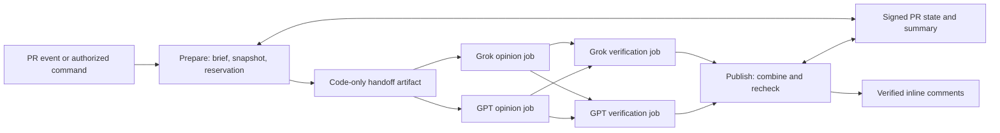

# Architecture and trust boundaries

```mermaid
flowchart LR
    E[PR event or authorized command] --> P[Prepare: brief, snapshot, reservation]
    P --> H[Code-only handoff artifact]
    H --> G[Grok opinion job]
    H --> C[GPT opinion job]
    G --> VG[Grok verification job]
    C --> VG
    G --> VC[GPT verification job]
    C --> VC
    VG --> D[Publish: combine and recheck]
    VC --> D
    P <--> S[Signed PR state and summary]
    D <--> S
    D --> I[Verified inline comments]
```

## Jobs and credentials

| Job | Credentials delivered to the process | Repository code execution |
| --- | --- | --- |
| Prepare | GitHub write token, state signing key | None |
| Generate, one job per lane | That lane's provider key only | Grok: none. GPT: only inside Codex's read-only, no-network sandbox |
| Verify, one job per lane | That lane's provider key only | Same as generate |
| Publish | GitHub write token, state signing key | None |

Generation and verification are matrix jobs over the lanes that prepare reports.
They run with `permissions: {}`, and matrix expressions blank the other lane's key
and Variables. The engine refuses to start an inference phase when `GH_TOKEN` or
`REVIEW_STATE_KEY` is present, or when a lane's model, base URL, effort or context
Variable differs from the value recorded at reservation. Lane results are checked
for credential values before they are written (`credential_in_review_output`).

GitHub Environment access is a job-level boundary: every job references the
consumer's protected Environment, while individual steps explicitly receive only
the needed Secrets. Both the reusable workflow and caller explicitly list the
accepted secret names. Environment binding alone yielded empty Secrets in live
acceptance, consistent with [runner issue 1490](https://github.com/actions/runner/issues/1490)
and [issue 4453](https://github.com/actions/runner/issues/4453). Preserve the explicit
name mapping; values remain in the protected consumer Environment. A maintainer who
can alter a trusted default-branch workflow can alter this boundary. Use required
reviews/CODEOWNERS for `.github/` and rules where the project needs stronger governance.

The caller pins the reusable workflow to commit B; that workflow pins the composite
Action/engine to reviewed commit A. Checkout in a reusable workflow refers to the
caller repository, so prepare explicitly checks out the trusted `github.sha` and
loads only configuration files. Policy files reject symlinks and traversal outside
the trusted checkout. PR content reaches later jobs only through the handoff
artifact: the brief and the snapshot archive.

`pull_request_target` and `issue_comment` run default-branch workflow code. Neither
PR-provided workflow changes nor repository content can select models, credentials,
tool permissions, budgets or publishing targets. Current repository identity,
default branch, same-repository head, open/draft status, and SHA are checked before
reservation and publication. GitHub does not provide an atomic "write only if PR
head still equals X" operation; commit-anchored comments and rechecks minimize, but
cannot eliminate, a push racing an API request.

## Brief and repository snapshot

Prepare lists the PR files and the merge base through the GitHub API (at most
`max_api_reads`, default 300) and builds the brief: title, the description up to
`description_chars` (default 60,000) marked as the author's claims and flagged when
truncated, the changed-file list with status and line counts, and patches
admitted largest change first while they fit in `brief_chars` (default 400,000). A
patch left out of the brief stays readable in the snapshot. The brief also holds the
per-lane plan: scope, incremental paths and whether the lane generates.

The snapshot is a bare git repository holding exactly two commits, the PR head and
the merge base, fetched with `--depth=1`, no tags and no submodules. Every git call
runs without user or system configuration, with hooks, fsmonitor, symlinks,
external diff, text conversion and credential helpers disabled and only the
`https` and `file` protocols allowed. Of the git processes, only the fetch receives
the GitHub token, as an HTTP header in its environment. The archive (at most 1 GB)
and its SHA-256 travel in the handoff artifact. Every later job verifies the digest
and both commit refs, and extraction accepts only regular files and directories.

Both lanes receive the same prompt structure: trusted maintainer rules, a
description of their repository access, required checks, output rules and the lane's
scope, followed by the brief as untrusted data. The required checks ask reviewers to
compare which inputs each changed parser, validator, guard, query builder or
serializer accepted at the merge base and at the head, to check callers of changed
functions, and to verify the description's behavioural claims against the code.

## Reviewer lanes

| | Grok | GPT |
| --- | --- | --- |
| Backend and harness | `grok-tools`, `responses_tools` | `gpt-codex`, `codex_cli` |
| Repository access | Engine-implemented `read_file`, `grep`, `list_files` and `diff` over git objects of head or merge base | Official Codex CLI `codex exec` over a head checkout; read-only shell, `git show` of the merge base |
| Effort (generation, verification) | `GROK_EFFORT`, default `xhigh`, for both | `GPT_EFFORT`, default `ultra`; `GPT_VERIFY_EFFORT`, default `xhigh` |
| Per-call limits | 40 turns, 80 tool calls, 60,000 characters per tool result, 1,200,000 in total, 3,600 s with 600 s kept for the final answer | 400 requests, 30,000,000 tokens, 3,600 s |
| Reserved tokens (generation, verification) | 4,000,000 and 2,000,000 | 8,000,000 and 3,000,000 |

The Grok lane runs a stateless Responses API loop: each request resends the earlier
output items, including reasoning, with `store: false`, the four function tools and
the strict JSON schema of the final answer. Tools return bounded text with explicit
truncation markers; blobs above 4 MB, binary files and non-UTF-8 files are refused.
Nothing reachable through the tools lies outside the two commits, and the model
executes nothing. When a turn, call, output, context or time limit is reached, the
loop asks for the final answer with tools disabled and records `stopped_reason`.
Its input budget is the configured window minus the larger of 16,000 tokens, ten
percent of the window and the 128,000-token completion reserve. Each turn is a
bounded SSE request with 20 s connect and 120 s idle limits under the lane's total
deadline. A terminal completed Responses event is required; lane results keep usage
and timing counters, not reasoning or raw responses.

The GPT lane runs the pinned Codex release (`independent_review/codex-release.json`,
checksum-verified at install, version checked before use) with a disposable
`CODEX_HOME`. The generated configuration sets `sandbox_mode = "read-only"`,
`approval_policy = "never"`, disables web search, history, memories, analytics,
update checks and unneeded features, and ignores repository `AGENTS.md` files and
rules. The prompt is passed on standard input. Codex reports commands as JSONL
events; the engine keeps bounded, redacted command strings and fails the lane on
MCP or web search calls. Requests of Codex subagents, which `ultra` enables, go
through the same proxy and count toward the lane's limits and usage.

A consumer can select another backends file through `backends` in `review.json`.
It must define two slots with distinct opinion families and one backend each, using
the `responses_tools` or `codex_cli` harness; disabled backends are rejected.

## GPT lane key isolation

On Linux, each inference process calls `prctl(PR_SET_DUMPABLE, 0)` before it reads
a secret, so same-user processes cannot read its `/proc` environment or memory. The
GPT runner then removes `GPT_API_KEY` from its environment and starts a loopback
credential proxy on `127.0.0.1` with a random per-run token. Codex receives only
`PATH`, `HOME`, `CODEX_HOME`, `TMPDIR`, `LANG` and that token in
`REVIEW_PROXY_TOKEN`; its `shell_environment_policy` (`inherit = "core"`, excluding
`REVIEW_*`, `*TOKEN*`, `*KEY*` and `*SECRET*`) keeps the token out of sandboxed
commands. The composite Action starts each phase with `exec`, so no step shell keeps
the key in its environment.

The proxy accepts only authenticated `POST` requests to `/v1/responses` and
`/v1/responses/compact` with identity encoding, a declared length up to 64 MB and
the configured model. It forwards allowlisted headers with the real key to the
HTTPS upstream, streams the response back, and counts requests, requested efforts,
statuses and reported usage without storing bodies or headers. It refuses further
requests at the lane's request, token or time limit. Codex output streams are
scanned for the key and proxy token; a match fails the lane (`credential_in_output`).

Before the GPT phase, the Action runs `scripts/qualify_codex_sandbox.py` in a clean
`env -i` environment, without a provider key. It runs a probe once unsandboxed as a
control and once through `codex sandbox -P :read-only` with the runner's generated
configuration, and fails if the sandboxed probe can write to the checkout, `TMPDIR`
or `HOME`, connect to loopback or external addresses, resolve DNS, or find canary
values in its own environment, any readable process environment or `ps` output, or
if the control could not observe what the sandbox must block. Ubuntu 24.04 and later
restrict the unprivileged user namespaces that Codex's bubblewrap sandbox needs, so
the Action first sets `kernel.apparmor_restrict_unprivileged_userns=0` on the
disposable VM; the qualification must still pass. CI runs the same qualification.
In the `codex-sandbox` jobs of [CI run 37251301986](https://github.com/reed-yang/independent-pr-review/actions/runs/37251301986)
(Ubuntu 24.04 and 26.04, Codex 0.159.1), writes, loopback, DNS and external
connections were blocked and no canary was visible in the sandbox environment or in
any process environment. The sandboxed probe could read the environment of only two
processes, consistent with its own PID namespace (control: seven). The unsandboxed
control found the canaries in the shell that started the engine and in other
processes, but not in the non-dumpable engine.

On macOS, a command inside Codex's Seatbelt sandbox can read the launch environment
of same-user processes through `sysctl` `KERN_PROCARGS2`. Provider keys must
therefore never be in any launch environment on macOS: local replay reads them from
the Keychain into its own process, and `scripts/replay.py` refuses to start when a
key is exported and the Codex lane is selected. Hosted Linux runners are the
supported deployment.

## Verification and findings

Every phase derives the verification plan from the bundle, lane results and
snapshot only, so separate jobs compute the same plan. Candidates are the valid
findings of completed or partial lanes, previous open or uncertain findings, and
previously dismissed findings whose file changed since a lane's baseline. Up to
`max_verification_candidates` (default 10) are verified per run, a
`/review verify` target first, then previous findings; overflow leaves the run
partial. Each candidate goes to the first lane that did not report it, and one
reported by both lanes goes to the last lane (GPT). A lane skipped by its generation
policy still verifies. A lane whose generation failed with a configuration or
authorization error (for example a missing key or HTTP 401) is not called again
(`verification_skipped_after_provider_failure`); after a transient provider error it
still verifies. The Grok tool loop resends a turn that failed with HTTP 429/5xx, a
connection error or an interrupted stream up to twice, after 10 and 30 seconds;
Codex retries upstream errors itself.

A generated finding needs a changed-file path, severity P1 or P2, ordered trigger
steps, mechanism, consequence, and evidence: an exact quote of at least 8
characters from that file at the head or merge base, its patch, or one contiguous
side of a diff hunk. Only the whitespace at the start and end of each quoted line may
differ: the first line must end a source line, the last must start one, and lines
between must equal whole source lines. A lane returns at most five
findings. Invalid candidates are recorded with bounded, redacted quote diagnostics
and excluded; valid siblings are kept, and the lane stays partial. Verifiers decide
confirmed, dismissed, fixed or uncertain. Every decision except uncertain cites an
exact quote from any repository file in the snapshot; fixed applies only to previous
findings and needs head evidence. A decision whose quote does not match becomes
uncertain and leaves the batch partial; identity or schema errors reject the batch.
A confirmed candidate becomes open. For a finding that already has an inline
comment, a dismissal becomes uncertain, so only a verified fix removes it; an
unpublished finding can be dismissed. A
finding found by only one reviewer can survive verification. This improves
traceability; the model's causal reasoning can still be wrong.

Every review and verification input ends with a fresh random `END_OF_INPUT_NONCE`
line that the reply must copy into `input_end_nonce`. A missing or different value
(`input_end_nonce_missing`, `input_end_nonce_mismatch`) keeps evidence-checked
results but marks that lane or batch partial, so it cannot advance a baseline.

Only unique added/deleted diff-line matches become inline anchors. Finding identity
uses normalized evidence, path and nearby scope, with rename carryover. This is
stable under wording changes, not a universal semantic identity: substantial code
rewrites can produce a new ID. Every normalized opinion, trace and verification
decision is retained in the short-lived report artifact.

## State, incremental work and budgets

One owned summary stores a bounded compressed JSON envelope authenticated with a
per-consumer HMAC key. State binds repository/PR, run reservation, bundle and
configuration identity, per-lane successful base/head, findings and owned comment
IDs. Verify the MAC before bounded decompression; malformed owned state fails
closed. Ordinary contributors cannot forge state using a comment or model output.
This is not a tamper-proof audit log against administrators who can edit workflows,
delete state, or replace Secrets, and it does not prevent replay by a privileged
administrator.

Prepare records a reservation before any provider call: the generation estimate of
each lane that will generate plus the verification estimate of every lane (17M
tokens for a full run with the default backends), checked against
`max_tokens_per_pr` (default 60M) and `max_runs_per_pr` (default 8). Publication
replaces the estimate with reported usage, summed over every request of a lane
including Codex subagents; a lane without usable usage keeps its estimate.
Interrupted runs retain the run count and estimate. Run count is a hard per-PR
limit; token accounting is a soft guard, not a provider-side spend ceiling. The
per-call limits above bound each provider call.

Same base/head/configuration for every lane reuses the previous result without a
reservation or model call. Otherwise each lane compares its successful baseline head
with the current head: files changed since then become the lane's focus, and the
prompt asks it to follow callers, callees and tests anywhere in the repository.
Changes outside the PR's files, force pushes, rebases, a changed base or
configuration, missing history and incomplete comparisons fall back to a full
review. A run in which no lane has new work to generate, because the snapshot is
unchanged or generation policies skip it, makes no reservation or model call. Each
lane advances its baseline only when its generation and every verification batch
completed. Prior unresolved findings are reverified when a new run occurs; silence
never means fixed.

Per-PR caller concurrency must use `cancel-in-progress: false`. GitHub does not
offer a shared concurrency lock across consumer repositories.

Code-only `bundle.json` and `snapshot.tar.gz` cross jobs in an artifact retained
for three days; per-lane opinion and verification results are retained for three
days, and the combined `result.json` and `result.md` for seven. No `CODEX_HOME`,
Codex output streams, proxy traffic or credentials are uploaded. Treat these
artifacts as repository source with the repository's artifact access controls.
